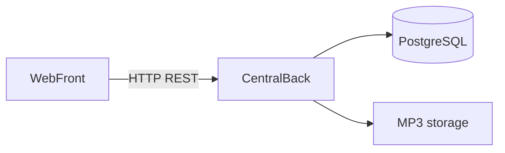

# Arquitectura

Documento del repo general [`audio-streaming`](https://github.com/B3RT1C/audio-streaming).

## Alcance v0.1.0

Solo **back central + cliente web**. No hay desktop, mobile ni mini-back local en esta versión.

El contrato HTTP (fuente de verdad) está en el backend:

[docs/openapi.yaml](https://github.com/B3RT1C/audio-streaming-backend/blob/main/docs/openapi.yaml)

No hay paquete shared.

## Responsabilidades (v0.1.0)

- **Back central**: catálogo, metadata, almacenamiento y contrato OpenAPI. Esquema Postgres vía **Flyway** (sin wipe de datos de usuario); migraciones `V{seq}__app_{x}_{y}_{z}_…` (detalle en el README del backend).
- **Front web**: UI y reproducción online vía `PlaybackResolver` (URL del back central).

## Contrato de reproducción

- `GET /audios`
- `GET /audios/{id}` con soporte HTTP Range
- `POST /audios` (`name` opcional; títulos repetibles)
- `DELETE /audios/{id}`
- Errores: `{ message, code }` (ver OpenAPI)

## Más adelante

Desktop, mobile, mini-back local y sync quedan fuera de v0.1.0. Ver [roadmap.md](./roadmap.md).
