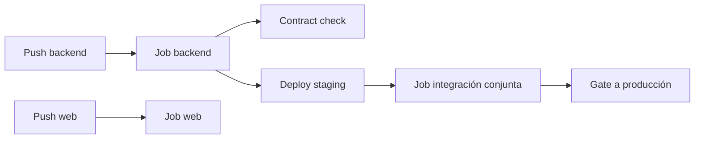

# Integración CI/CD con Jenkins

Documento de diseño para automatizar build, tests y despliegue del ecosistema **audio-streaming**, desplegado en un Jenkins propio en la red local.

## 1. Objetivo

Al hacer push (o merge) a la rama de producción de cada repositorio:

1. Descargar los cambios.
2. Compilar.
3. Ejecutar tests unitarios / de contrato.
4. Desplegar solo si todo pasa en verde.

Además, cuando cambie el **backend**, detectar roturas en **web** con **pruebas conjuntas** antes de promover a producción. Desktop/mobile quedan fuera de v0.1.0 (fase posterior).

## 2. Contexto del proyecto

El producto está partido en varios repos/carpetas:

| Carpeta local | Repo remoto | Rol |
|---------------|-------------|-----|
| `audio-streaming-backend` | [B3RT1C/audio-streaming-backend](https://github.com/B3RT1C/audio-streaming-backend) | API central (Java / Spring Boot) + OpenAPI |
| `audio-streaming-web` | [B3RT1C/audio-streaming-web](https://github.com/B3RT1C/audio-streaming-web) | Cliente web (Angular) |
| `audio-streaming-desktop` | pendiente | Cliente desktop |
| `audio-streaming-mobile` | pendiente | Cliente mobile |
| `audio-streaming` | [B3RT1C/audio-streaming](https://github.com/B3RT1C/audio-streaming) | Docs, roadmap, estado |

El back es la fuente de verdad. Los fronts consumen el mismo contrato HTTP (`GET/POST/DELETE /song`, streaming con HTTP Range), documentado en el OpenAPI del backend: [docs/openapi.yaml](https://github.com/B3RT1C/audio-streaming-backend/blob/main/docs/openapi.yaml). Ver [arquitectura.md](./arquitectura.md).

## 3. Infraestructura prevista

| Elemento | Detalle |
|----------|---------|
| Máquina Jenkins | `192.168.1.79` (RDP **3389**, SSH **22**, usuario `b3-ml`) |
| UI Jenkins | **http://192.168.1.79:8081/** (desplegado; no usar **8080**) |
| Requisitos en el agente | JDK 26 (builds), Temurin 21 (servicio Jenkins), Maven 3.9, Node 24, Git — instalados. PostgreSQL CI pendiente |
| Disponibilidad | La PC debe permanecer encendida y estable; si se apaga, no hay CI/CD |

RDP (`3389`) y Jenkins son servicios distintos. Estado del despliegue: [jenkins-deploy-report.md](./jenkins-deploy-report.md).

Notas de red:

- En LAN, Jenkins es alcanzable por IP interna.
- Trigger actual: **Poll SCM** (`H/2 * * * *`) — Jenkins consulta GitHub cada ~2 min. No hace falta túnel ni webhooks.
- Si en el futuro se quieren webhooks (build al instante), haría falta un túnel o IP pública.

## 4. Principio de diseño: un pipeline por repo

No existe un único job “del proyecto audio”. Cada cambio dispara **solo el pipeline del repo afectado**:

En **v0.1.0** solo existen pipelines de backend y web:



| Job | Trigger | Responsabilidad |
|-----|---------|-----------------|
| `audio-streaming/backend` | Push a `main` / `prod` (o PR) | `mvn test` → empaquetar → deploy API |
| `audio-streaming/web` | Push a `main` / `prod` | `npm test` / build → deploy estático o contenedor |
| `audio-streaming/integration` | Tras deploy de back (o web) a **staging** | Smoke / e2e back + web |

Desktop/mobile (fuera de v0.1.0): jobs propios cuando existan esos clientes.

## 5. El problema multi-repo: roturas cruzadas

Si el backend se despliega solo con sus tests unitarios, puede romper la web sin que el job del back lo detecte.

Solución en tres capas:

### 5.1 Contract tests (barato, siempre)

- El contrato vive en el **backend** (`docs/openapi.yaml`).
- El job del **backend** valida que la API implementada sigue el contrato.
- El job de cada **cliente** valida que consume el mismo contrato (cliente generado, tests de esquema, o asserts sobre paths/métodos).

Si hay un breaking change incompatible, falla **antes** del deploy a producción, sin necesidad de levantar emuladores mobile en cada commit.

### 5.2 Entorno de staging compartido

Flujo recomendado:

```
cambio en backend
  → unit + contract
  → deploy a STAGING
  → job de integración (back + web)
  → si verde → deploy a PRODUCCIÓN
```

Staging debe ser lo más parecido posible a prod (misma imagen Docker, misma BD de prueba, mismas variables salvo secretos).

### 5.3 Job de integración conjunta

Pipeline `audio-streaming/integration` que:

1. Clona (o reutiliza artefactos de) `backend` + `web`.
2. Levanta dependencias con Docker Compose (PostgreSQL, y opcionalmente el back).
3. Arranca API en staging / local CI.
4. Apunta el front de tests a esa API.
5. Ejecuta **smoke / e2e** de flujos críticos:
   - listar canciones
   - subir MP3
   - reproducir con Range
   - borrar canción
6. Falla el pipeline si cualquier smoke falla → **no promover a prod**.

Desktop y mobile no entran en v0.1.0; cuando existan, empezar con smoke manual o nightly contra staging.

## 6. Organización en Jenkins

Estructura de carpetas sugerida:

```
audio-streaming/
├── backend
├── web
├── desktop          # futuro
├── mobile           # futuro
└── integration
```

Convenciones:

- Credenciales (SSH, tokens GitHub, claves de deploy) solo en **Jenkins Credentials**, nunca en el repo.
- Cada job versionado con `Jenkinsfile` en su propio repositorio (Pipeline as Code).
- El job `integration` puede vivir en el repo general `audio-streaming` o en un repo `audio-streaming-ci` dedicado.

### Esqueleto de flujo backend (`Jenkinsfile`)

```groovy
pipeline {
  agent any
  stages {
    stage('Checkout') { steps { checkout scm } }
    stage('Test') {
      steps { sh './mvnw -B test' }
    }
    stage('Contract') {
      steps { sh './mvnw -B verify -Pcontract' } // o script OpenAPI
    }
    stage('Package') {
      steps { sh './mvnw -B -DskipTests package' }
    }
    stage('Deploy staging') {
      when { branch 'main' } // o prod, según convención
      steps { sh './scripts/deploy-staging.sh' }
    }
    stage('Trigger integration') {
      when { branch 'main' }
      steps {
        build job: 'audio-streaming/integration', wait: true
      }
    }
    stage('Deploy production') {
      when { branch 'main' }
      steps { sh './scripts/deploy-prod.sh' }
    }
  }
}
```

El detalle de scripts de deploy depende de dónde corra la API (misma máquina, otro host, Docker). Lo importante es el **orden**: staging → integración → prod.

### Esqueleto de integración

```groovy
pipeline {
  agent any
  stages {
    stage('Compose up') {
      steps { sh 'docker compose -f docker-compose.ci.yml up -d --wait' }
    }
    stage('Start API') {
      steps { sh './scripts/ci-start-backend.sh' }
    }
    stage('E2E web') {
      steps {
        dir('audio-streaming-web') {
          sh 'npm ci && npm run e2e:ci'
        }
      }
    }
  }
  post {
    always { sh 'docker compose -f docker-compose.ci.yml down -v || true' }
  }
}
```

## 7. Ramas y promoción

| Rama / entorno | Uso |
|----------------|-----|
| feature / PR | Build + tests; sin deploy a prod |
| `main` o `develop` → **staging** | Deploy automático a staging + integración |
| promoción a **prod** | Solo si integración verde (automática o botón manual “Promote”) |

Orden de despliegue cuando el contrato cambia:

1. Backend (compatible hacia atrás si es posible).
2. Clientes (web, luego desktop/mobile).

Si el cambio es **breaking**, versionar API (`/v2`) o coordinar release etiquetado (`backend vX requiere web ≥ Y`).

## 8. Qué automatizar por fase

### Fase 1 (back + web) — hecha

- [x] Jenkins en `192.168.1.79:8081`
- [x] Jobs `backend` / `web` con `Jenkinsfile` en SCM
- [x] Job `integration` (smoke API + Postgres WSL)
- [x] Job `deploy-staging` (API en `:8080`)
- [x] Poll SCM en `backend` / `web` (`H/2 * * * *`); webhooks y túnel retirados
- [x] Flujo: tests → `integration` → deploy staging (API `:8080`, web `:8083`)

### Fase 2

- [ ] (Opcional) Webhooks + túnel nombrado si se quiere build al instante
- [x] Encadenar backend/web → integration → deploy staging
- [x] Servir front web de staging (`:8083`)
- [ ] Notificaciones en rojo
- [ ] Artefactos versionados (tags `v0.x.y`)

### Fase 3 (desktop / mobile)

- [ ] Jobs de build específicos (SDK Android, firmas, etc.).
- [ ] Nightly de smoke contra staging.
- [ ] Integración completa solo en releases, no en cada commit del back.

## 9. Alternativas y cuándo quedarse con Jenkins

Jenkins encaja si se quiere **todo on-prem** en esta PC, un único panel para varios repos y control total de agentes.

Si el mantenimiento pesa más que el control local, **GitHub Actions** por repo (más un workflow reutilizable de integración) es una alternativa válida con el mismo diseño lógico (pipeline por repo + job conjunto + staging).

La arquitectura de pruebas (contrato + staging + integración) **no depende** de Jenkins; solo cambia el orquestador.

## 10. Resumen

| Pregunta | Respuesta |
|----------|-----------|
| ¿Tiene sentido Jenkins al committear a prod? | Sí: build → test → deploy automático. |
| ¿Un solo job para todo el monorepo lógico? | No: un job por repo + uno de integración. |
| ¿Se pueden hacer pruebas conjuntas? | Sí: contract tests + staging + e2e multi-repo. |
| ¿Por dónde empezar? | Backend + web; desktop/mobile después. |
| ¿Puerto 3389? | RDP. Jenkins en **8081** (ya desplegado); **8080** es la API. |

## Referencias internas

- [arquitectura.md](./arquitectura.md) — visión back + web (v0.1.0)
- [roadmap.md](./roadmap.md) — desktop / mobile / mini-back / sync (futuro)
- [README de este repo](./README.md) — docs, estado y enlaces a repos
- [OpenAPI del backend](https://github.com/B3RT1C/audio-streaming-backend/blob/main/docs/openapi.yaml) — contrato HTTP
- Resumen: puerto **3389** = RDP; Jenkins ≠ **8080** (reservado a la API).
